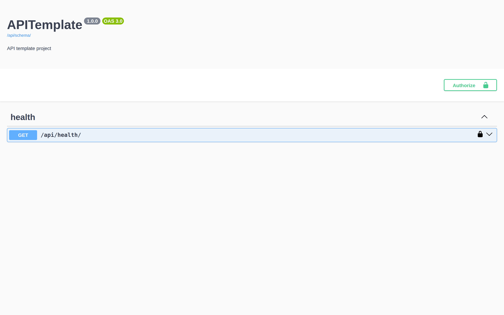
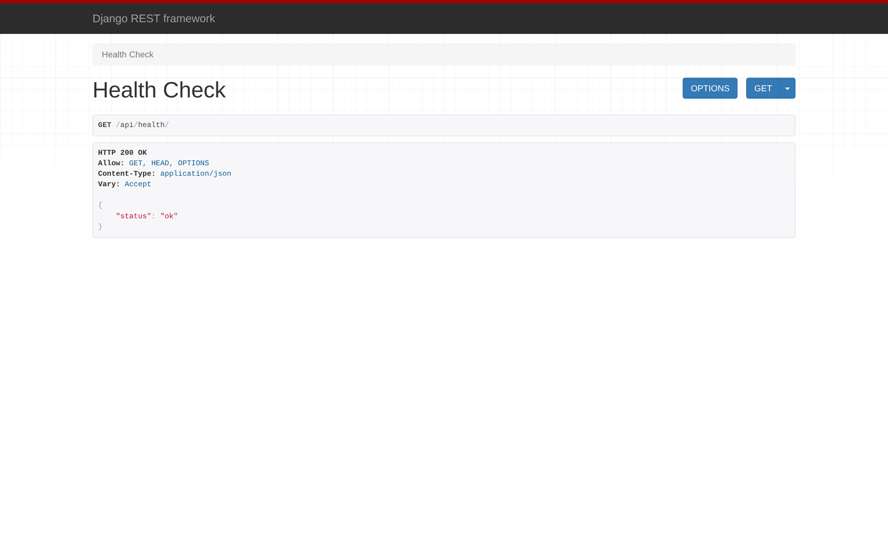

# API Template

A minimal Django REST Framework starter with OpenAPI documentation and a
health-check endpoint, meant to be copied as the base of a new JSON API.

## Stack

- Django 6.1
- Django REST Framework 3.18
- drf-spectacular (OpenAPI 3 schema + Swagger UI)
- django-environ (settings read from `.env`)
- SQLite (development default)

## Getting started

```bash
python -m venv .venv
.venv/bin/pip install -r requirements.txt

cp .env.example .env          # then set SECRET_KEY

.venv/bin/python manage.py migrate
.venv/bin/python manage.py test       # 4 tests
.venv/bin/python manage.py runserver
```

## What you get

Interactive OpenAPI docs at `/api/docs/`, generated from the code by
drf-spectacular — no hand-written schema to keep in sync.



DRF's browsable API is left on in development, so endpoints can be tried
without any extra tooling.



## Endpoints

| Path | Description |
|---|---|
| `/api/health/` | Health check, returns `{"status": "ok"}` |
| `/api/schema/` | OpenAPI 3 schema (YAML) |
| `/api/docs/` | Swagger UI |
| `/admin/` | Django admin |

## Layout

```
apitemplate/     # project settings, urls, wsgi/asgi
apps/            # the API app: health-check view, urls, tests
manage.py
```

## Environment variables

| Variable | Description |
|---|---|
| `SECRET_KEY` | Django secret key (required) |
| `DEBUG` | Debug mode, `True` / `False` (default `True`) |
| `ALLOWED_HOSTS` | Comma-separated hosts (default `localhost,127.0.0.1`) |
